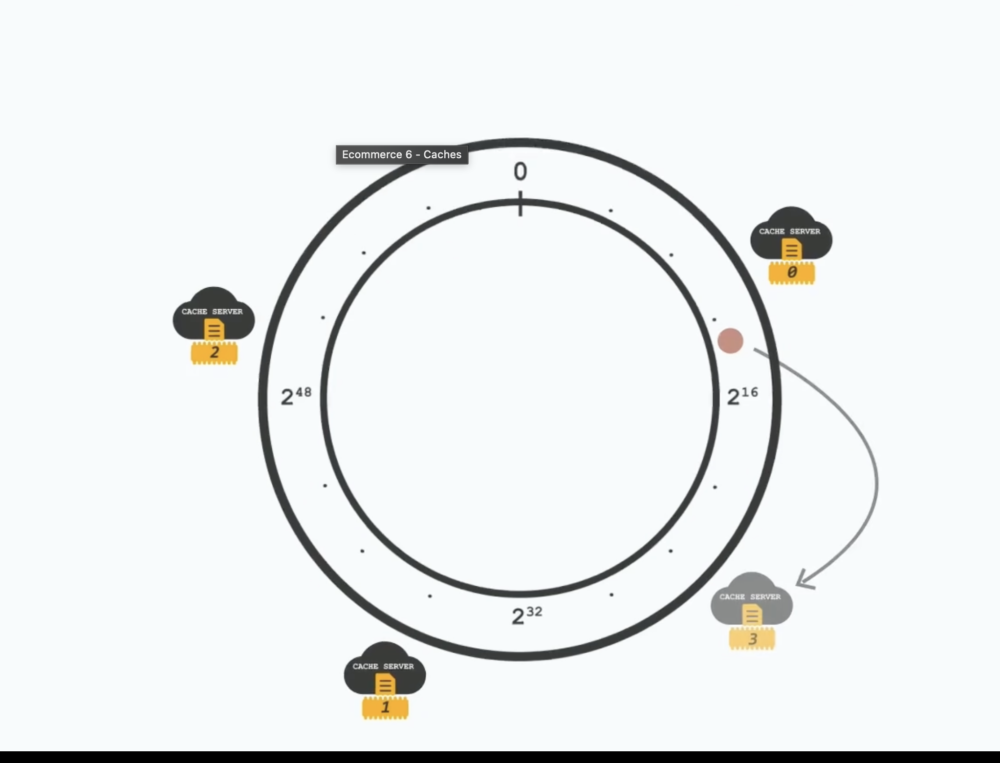

# **Distributed Caching and Performance Architecture**

## **Core Metric**

Cache performance is measured by Average Memory Access Time (AMAT):

$$AMAT = Hit \ Time + (Miss \ Rate \times Miss \ Penalty)$$

To optimize AMAT, one must tune four key factors:

- **Eviction Policy**
- **Write Policy**
- **Data Distribution**
- **Cache Placement**.

---

## **1. Eviction Policies (Replacement Policies)**

When the cache reaches capacity (is full), these policies dictate which specific data items must be removed (evicted) to make space for new incoming data,.

### **A. LRU (Least Recently Used)**

- **Definition:** This policy identifies and evicts the item that has not been accessed for the longest duration of time. It relies heavily on the principle of **Temporal Locality**,.
- **Standard Example:** A web browser history. If you visit Site A, then B, then C, then D, and the cache is full, Site A (the earliest visited) is evicted first.
- **Specific Use Case:** **Social Media Feeds** (e.g., Twitter/Instagram).
- **Reasoning:**
  - Social media users prioritize **recency**.
  - A post may have high historical engagement (e.g., 1 million likes) from 2 days ago, but it is less relevant to the user than a post from 1 hour ago.
  - LRU ensures content remains fresh in the feed,.

### **B. LFU (Least Frequently Used)**

- **Definition:** This policy tracks the number of times a block or item is accessed. The block with the fewest total accesses (hits) is selected for eviction,.
- **Standard Example:** A Content Delivery Network (CDN) storing video files. A viral video is kept; a one-time obscure video is dropped.
- **Specific Use Case:** **E-Commerce Catalogs**.
- **Reasoning:**
  - Popular products (e.g., a standard iPhone model) remain popular for long periods.
  - LFU provides **stability** by preventing established popular items from being evicted by a momentary surge of new, less important items,.
- **Downside:** It is susceptible to **"Cache Pollution."** An item that was extremely popular last month might stay in the cache forever due to a high historical frequency count, even if no one is watching or accessing it today.

### **C. FIFO (First-In, First-Out)**

- **Definition:** This policy evicts the oldest block added to the cache, regardless of how recently or frequently it has been used,.
- **Example:** A printer buffer queue.
- **Downside:** This policy can suffer from **Belady's Anomaly**, a phenomenon where increasing the amount of available cache memory actually _increases_ the miss rate.

### **D. Random Replacement**

- **Definition:** The system randomly selects a victim block to evict.
- **Example:** **ARM processors**.
- **Reasoning:** This is used in hardware environments where the overhead of tracking LRU history is too expensive relative to the performance gain.

---

## **2. Write Policies**

These policies determine how data consistency is managed between the **Cache** and the **Database (DB)** when data is modified.

### **A. Write-Through**

- **Mechanism:** Updates are written to the Cache and the DB **simultaneously**,.
- **Decision Criterion:** Use this when **Data Integrity** is paramount (Safety > Speed),.
- **Specific Example:** **Financial/Banking transactions**. You cannot afford to lose a deposit record,.
- **Pros:** Strong consistency; the Database is always up-to-date.
- **Cons:** High latency, as the write speed is limited by the slower Database performance,.

### **B. Write-Behind (Write-Back)**

- **Mechanism:** Updates are written **only to the Cache** initially. The Database is updated later (asynchronously),.
- **Decision Criterion:** Use this when **Write Speed** is paramount (Speed > Safety),.
- **Specific Example:** **Real-time analytics counters** (e.g., YouTube view counts, "700 users watching"). Losing a few increments is acceptable in exchange for performance,.
- **Pros:** Extremely low latency.
- **Cons:** **Data Loss Risk.** If the cache crashes before it syncs with the DB, the updates are permanently lost,.

### **C. Write-Around**

- **Mechanism:** Data writes bypass the cache entirely and go **directly to the DB**. Data is only loaded into the cache if it is read later,.
- **Decision Criterion:** Use for **"Write-Once, Read-Rarely"** data.
- **Specific Example:** **Log files**, **Data Backups**, or uploading large media files,.
- **Pros:** This prevents **"Cache Flooding"** (filling the valuable cache space with useless data that will not be read again),.

### **D. Write-Aside (Look-Aside)**

- **Mechanism:** The application code controls the flow. It checks the cache; if the data is missing, the application reads from the DB and manually updates the cache.
- **Use Case:** General-purpose caching patterns (e.g., Memcached).

### **Common Challenges & Solutions**

- **Inconsistent Data:** The DB and Cache hold different values.
  - _Solution:_ Update the cache infrequently using Time-To-Live (TTL) or utilize a Write-Through policy.
- **Stale Reads:** An update hits the DB, but subsequent reads still hit the old data in the Cache.
  - _Solution:_ Ensure the write policy invalidates (deletes) the cache entry immediately upon a write operation.

---

## **3. Data Distribution (Content Strategy)**

Optimizing _what_ you cache is just as critical as _how_ you cache it.

### **A. Optimization: The "Heavy Object" Problem**

- **Issue:** Caching a complex object (e.g., a massive User Profile containing history, settings, and logs) when the application only requires a single field (e.g., `username`). This fills memory with "dead weight".
- **Solution:** **Store only necessary data.** Use Data Transfer Objects (DTOs) or flattened structures rather than caching full objects,.

### **B. Optimization: The "Active User" Strategy**

- **Issue:** In a system with 1 million users, caching "Recently Viewed Items" (e.g., T-shirt_IDs) for everyone consumes massive memory, even for users who are inactive.
- **Solution:** **Filter Active Users.** Do not cache data for inactive users.
- **Filtering Metrics:**
  1.  **Frequency:** Select top users by `NUM_OF_LOG_INS` (e.g., User_32124 has 297 logins).
  2.  **Recency:** Select users with recent `LAST_LOG_IN` timestamps (e.g., User_32124 logged in at 21:43 today),.

### **C. Locality of Reference**

- **Temporal Locality:** If a data item is accessed now, it will likely be accessed again soon (e.g., Loop counters),.
- **Spatial Locality:** If `Address X` is accessed, `Address X+1` will likely be accessed soon (e.g., Arrays).
- **Working Set Size:** This refers to the amount of memory a process needs at a given time. If the Cache is smaller than the Working Set, **Thrashing** occurs (constant eviction leading to 0% performance).

---

## **4. Placement of Cache(s)**

### **Cache Hierarchy**

- **L1/L2/L3:** CPU-level caches,.
- **Client-Side:** Browser cache (saves network calls),.
- **CDN:** Geographically distributed static content (reduces latency by being physically closer to the user),.

### **Cache Mapping (Internal Placement)**

- **Direct Mapped:** A block maps to 1 specific line. (Fastest, but high conflict).
- **Fully Associative:** A block maps to _any_ line. (Slow search, zero conflict).
- **Set Associative:** A block maps to a specific _set_ of lines. (Balance of speed and conflict).

---

## **5. Distributed Caching & Scaling**

When a system grows beyond a single server, _where_ and _how_ the cache is deployed becomes the critical determinant of performance.

### **A. Deployment Strategies**

#### **1. In-Memory Cache**

- **Definition:** The application server holds the cache locally within its own memory.
- **Architecture:** Each instance of the application maintains its own private cache.
- **Pros:** **Zero network latency** (fastest possible access).
- **Cons:**
  - **Data Duplication:** The same data is stored across multiple app instances, wasting memory.
  - **Inconsistency:** Instance A might hold different data than Instance B.

#### **2. Centralized Cache (Distributed Cache)**

- **Definition:** A separate, shared layer of cache servers (e.g., Redis Cluster) accessible by all application nodes.
- **Pros:** **No Duplication.** It acts as a single source of truth for cached data.
- **Cons:** Network latency is added for every data fetch.

### **B. The "Scaling Problem" in Centralized Caching**

To scale a centralized cache, **Sharding** (splitting data into buckets based on IDs) is used. However, standard sharding faces a major issue when the cluster changes.

- **The Scenario:** A cache server crashes, or a new server is added to handle load.
- **The Problem:** Standard hashing uses `Key % N_Servers`. Changing the number of servers (\(N\)) invalidates almost **all** existing mappings.
- **Consequence:**
  - Massive cache misses occur.
  - **Cache Warmup/Readiness** takes a long time (minutes to days).
  - The Database is overwhelmed by traffic, leading to a **Thundering Herd** problem while the cache rebuilds.

### **C. The Solution: Consistent Hashing**

- **Definition:** A technique to map keys to cache nodes that minimizes key movement when the cluster resizes.
- **Mechanism (The Ring):**
  1.  **The Ring:** Both **Cache Servers** and **Data Keys** are hashed onto the same circular range (0 to \(2^{32}-1\)).
  2.  **Placement:** A key is stored on the **next server found moving clockwise** on the ring.
  3.  **Selection Probability:** The chance of a specific server being picked is \(1/N\).

- **Behavior on Change:**
  - **Node Removed:** Only the keys belonging to that specific node are moved to the next neighbor.
  - **Node Added:** It only takes keys from its immediate successor.
  - **Result:** Result: Only \(\approx \frac{K}{N}\) keys need to be remapped (not the whole keyspace).

- **Optimizing Skewness (Virtual Nodes):**
  - **Problem:** Data might be unevenly distributed (one server holds too much data) due to bad random hashing.
  - **Solution:** Use **Virtual Points** (Virtual Nodes). Each physical server appears at multiple positions on the ring (e.g., "Server A1", "Server A2", "Server A3"). This spreads the load more evenly.

- **Benefits:**
  1.  **Stability:** Adding/Removing servers is easy and safe.
  2.  **Faster Recovery:** Drastically reduces **Cache Warmup time** and increases **Cache Readiness** because the majority of the cache remains valid.
  3.  **Real-world usage:** Amazon DynamoDB, Redis Clusters, Cassandra.

---

## **Updated Summary Decision Matrix**

| I want to optimize for... | Scenario              | Recommended Strategy                              | Why?                                                             |
| :------------------------ | :-------------------- | :------------------------------------------------ | :--------------------------------------------------------------- |
| **Freshness**             | Social Media Feed     | **LRU** Eviction                                  | Users care about **recency** (freshness), not history,.          |
| **Stability**             | E-Commerce Catalog    | **LFU** Eviction                                  | Popular products (iPhone) stay popular for long periods,.        |
| **Data Integrity**        | Banking / Inventory   | **Write-Through** Policy                          | **Data Integrity** is critical. Zero data loss is allowed,.      |
| **Write Speed**           | View Counters / Likes | **Write-Behind** (Write-Back)                     | **Write Speed** is critical. Losing a few "likes" is acceptable. |
| **Cache Efficiency**      | Logs / Backups        | **Write-Around**                                  | Do not pollute the cache with data you won't read again.         |
| **Memory Usage**          | Limited Memory        | **Filter Active Users**                           | Do not cache data for inactive users to save space.              |
| **Zero Latency**          | High Speed Req.       | **In-Memory Cache** (Local)                       | Eliminates network calls.                                        |
| **Scalability**           | Large Scale Systems   | **Centralized Cache** with **Consistent Hashing** | Ensures consistency and easy scaling.                            |
| **Resilience**            | Adding/Removing Nodes | **Consistent Hashing**                            | Minimizes re-warmup time and prevents Thundering Herds.          |
